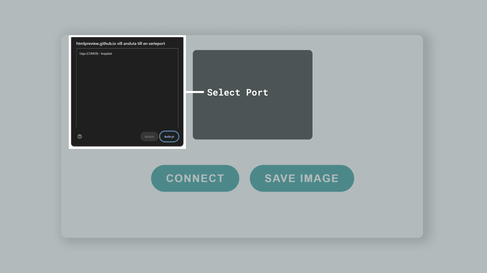

The GIGA R1 has a dedicated camera connector that allows certain camera modules to mount directly on the board. This makes it possible to add machine vision to your GIGA R1 board without much effort at all.

In this guide, we will explore the following:

- Where the camera connector is located.
- What cameras are compatible?
- What library to use? 
- How to set up a camera stream to a browser using webserial.

## Hardware & Software Needed

To follow and use the examples provided in this guide, you will need an [Arduino GIGA R1 WiFi](/hardware/giga-r1-wifi)

You will also need the following software:
- [Arduino IDE](https://www.arduino.cc/en/software) (any version).
- [Webserial]() (for displaying camera feed).

## Supported Cameras

The GIGA R1 currently supports the following cameras, via the [Camera](https://github.com/arduino/ArduinoCore-mbed/tree/master/libraries/Camera) library that is bundled with the [Arduino Mbed PS GIGA Board Package](https://github.com/arduino/ArduinoCore-mbed):

- **OV7670** and **OV7675**
- **GC2145**
- **Himax HM01B0**
- **Himax HM0360**

## Camera Connector


The 20 pin camera connector onboard the GIGA R1 is designed to be directly compatible with some breakout boards from ArduCam. 

This allows you to simply connect the camera module directly to the board, without making any additional circuit.


Some of the 20 pin connector breakout boards from ArduCam can be found [here](https://www.arducam.com/product-category/stm32-camera-modules-dcmi-and-spi/).

The complete pin map can be found below:

| Left | Right |
| ---- | ----- |
| 3V3  | GND   |
| SCL1 | SDA1  |
| 54   | 55    |
| 56   | 57    |
| 58   | 59    |
| 60   | 61    |
| 62   | 63    |
| 64   | 65    |
| 66   | 67    |
| 66   | 67    |


You can also view the schematic for this connector in more detail just below. This is useful to understand exactly which pins on the STM32H747XI microcontroller is used.


## Raw Bytes Over Serial


This example allows you to stream the sensor data from your camera to a web interface, using serial over USB. This will allow you to see the image directly in your browser.

### Step 1: Arduino

Upload the following sketch to your board.

This sketch is also available in the Arduino IDE via **Examples > Camera > CameraCaptureRawBytes**.

```arduino
#include "arducam_dvp.h"

//Change according to camera in use
#define ARDUCAM_CAMERA_OV767X

#ifdef ARDUCAM_CAMERA_HM01B0
    #include "Himax_HM01B0/himax.h"
    HM01B0 himax;
    Camera cam(himax);
    #define IMAGE_MODE CAMERA_GRAYSCALE
#elif defined(ARDUCAM_CAMERA_HM0360)
    #include "Himax_HM0360/hm0360.h"
    HM0360 himax;
    Camera cam(himax);
    #define IMAGE_MODE CAMERA_GRAYSCALE
#elif defined(ARDUCAM_CAMERA_OV767X)
    #include "OV7670/ov767x.h"
    // OV7670 ov767x;
    OV7675 ov767x;
    Camera cam(ov767x);
    #define IMAGE_MODE CAMERA_GRAYSCALE
#elif defined(ARDUCAM_CAMERA_GC2145)
    #include "GC2145/gc2145.h"
    GC2145 galaxyCore;
    Camera cam(galaxyCore);
    #define IMAGE_MODE CAMERA_RGB565
#endif

FrameBuffer fb;

void blinkLED(uint32_t count = 0xFFFFFFFF,uint32_t t_delay = 50)
{
    while (count--)
    {
        digitalWrite(LED_BUILTIN, LOW);  // turn the LED on (HIGH is the voltage level)
        delay(t_delay);                  // wait for a second
        digitalWrite(LED_BUILTIN, HIGH); // turn the LED off by making the voltage LOW
        delay(t_delay);                  // wait for a second
    }
}


void setup()
{
    pinMode(LED_BUILTIN, OUTPUT);
    // Init the cam QVGA, 30FPS
    if (!cam.begin(CAMERA_R320x240, IMAGE_MODE, 30))
    {
        blinkLED();
    }
    blinkLED(5);
    Serial.begin(921600);
}

void loop()
{
    if(Serial.read() != 0x01)
    {
        blinkLED(1,10);
        return;
    }
    // Grab frame and write to serial
    if (cam.grabFrame(fb, 3000) == 0)
    {
        Serial.write(fb.getBuffer(), cam.frameSize());
     }
    else
    {
        blinkLED(20,100);
        delay(1000);
    }
}

```

### Step 2: Web Serial

You can visit our [Web Serial Interface]() which allows you to view the camera feed. As data is streamed via serial, make sure you close the Serial Monitor during this process, else it will not work.


Press on **Connect** and select the correct port.



If all goes well, you should now be able to see the camera feed.

## Summary

In this article, we learned a bit more about the camera connector on board the GIGA R1 board, how it is connected to the STM32H747XI microcontroller, and a simple example on how to connect an inexpensive OV7675 camera module through web serial.